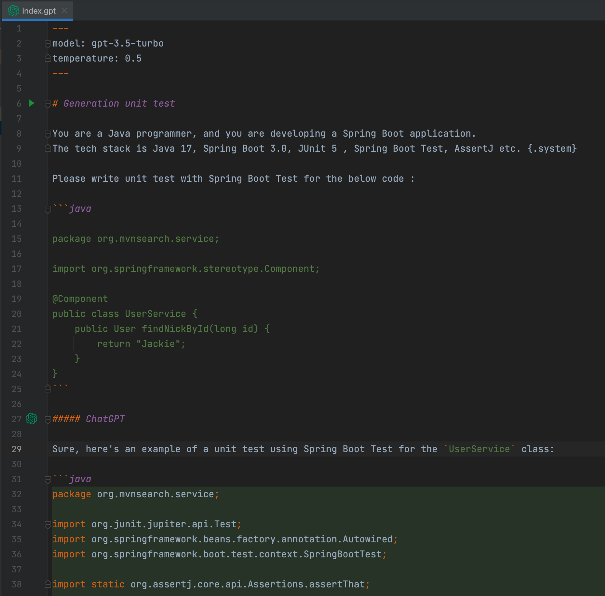
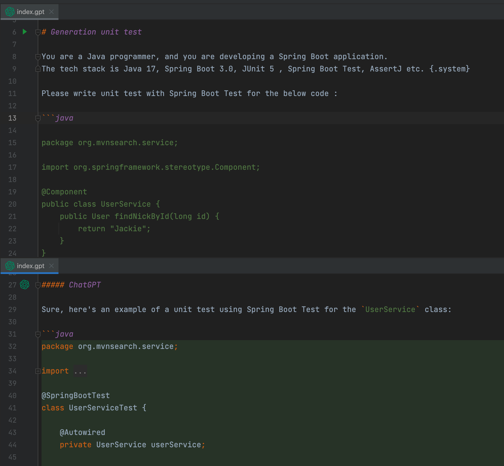

ChatGPT with Markdown
==================

Talk with ChatGPT from Markdown.



Editor split support: one for prompt, another for response.



`system` and `assistant` messages support, please add `{.system}` or `{.assistant}` after paragraph.

~~~markdown
# Generation unit test

You are a Java programmer, and you are developing a Spring Boot application.
The tech stack is Java 17, Spring Boot 3.0, JUnit 5 , Spring Boot Test, AssertJ etc. {.system}

Please write unit test with Spring Boot Test for the below code:

```java 
           
package org.mvnsearch.service;

import org.springframework.stereotype.Component;

@Component
public class UserService {
    public User findNickById(long id) {
        return "Jackie";
    }
}
``` 
~~~

<!-- Plugin description -->
ChatGPT with Markdown is a JetBrains IDE plugin to help you talk with ChatGPT from Markdown file.

Features:

* Standard Markdown format for ChatGPT
* Make a talk from Markdown
* Support to load OpenAI token from environment variable `OPENAI_API_KEY`
* Editor split support: one for prompt, another for response

<!-- Plugin description end -->

## Installation

- Using IDE built-in plugin system:
  
  <kbd>Settings/Preferences</kbd> > <kbd>Plugins</kbd> > <kbd>Marketplace</kbd> > <kbd>Search for "ChatGPT with Markdown"</kbd> >
  <kbd>Install Plugin</kbd>
  
- Manually:

  Download the [latest release](https://github.com/linux-china/markdown-chatgpt/releases/latest) and install it manually using
  <kbd>Settings/Preferences</kbd> > <kbd>Plugins</kbd> > <kbd>⚙️</kbd> > <kbd>Install plugin from disk...</kbd>
